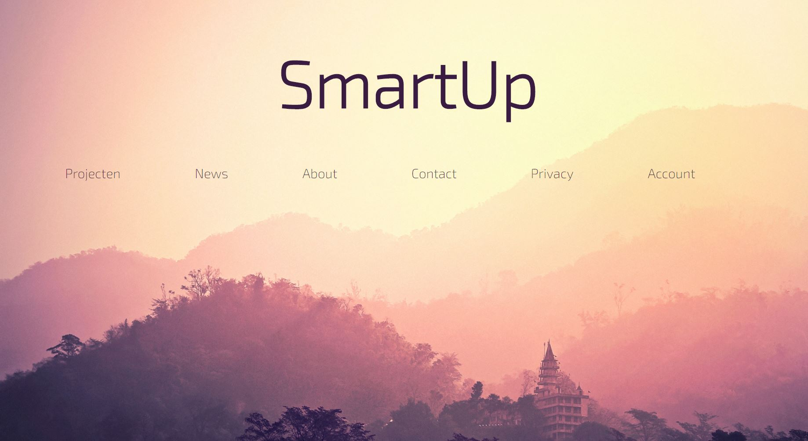

# Hoe moet je opstarten?

Om deze site te starten zal je eerst naar deze link moeten gaan:
https://github.com/gdm-1718-annadela/MMP_NMD_EXAMEN_WEBDEV/tree/master/laravel/kickstarter

1. Dan kan je kiezen of je om github zal downloaden of clonen.
2. De uitleg over hoe je deze opzet kan je ook terugvinden in het ReadMe bestand.
3. Achter het downloaden ga je naar de folder in de terminal. Localiseer naar waar je het document
hebt geplaatst.
4. Je zal composer nodig hebben om de site te starten.
5. Open een nieuwe terminal en geef composer global require “laravel/installer=~1.1” in.
Of ga naar de site en volg de stappen om composer te installeren: https://getcomposer.org/download/
6. Daarnaast zal je nog een envirementfile nodig hebben. Ga naar de rootfolder en maak daarin
een file “.env”.
## Wat moet er allemaal in de env file?
APP_NAME=Laravel  
APP_ENV=local  
APP_KEY=  
APP_URL=http://localhost  
LOG_CHANNEL=stack  
DB_CONNECTION=mysql  
DB_HOST=127.0.0.1  
DB_PORT= /Poort die je zelf gebruikt/  
DB_DATABASE=/_naam van gekozen database_/  
DB_USERNAME=/_naam van database gebruiker_/  
DB_PASSWORD=/_het wachtwoord van de database gebruiker_/  
BROADCAST_DRIVER=log  
CACHE_DRIVER=file  
QUEUE_CONNECTION=sync  
SESSION_DRIVER=file  
SESSION_LIFETIME=120  
REDIS_HOST=127.0.0.1  
REDIS_PASSWORD=null  
REDIS_PORT=6379  
MAIL_DRIVER=mailgun  
MAIL_HOST=smtp.mailgun.org  
MAIL_PORT=587  
1. Ga naar https://www.mailgun.com en maak een account aan.  
2. eef in je sandbox de gewenste mailadressen aan om de gebruikers mails te kunnen laten
ontvangen.  

MAIL_USERNAME=postmaster@sandbox142f8e77b5af46a9914160bfc37458fe.mailgun.org  
MAIL_PASSWORD=5f1348a05ccc810e6919515b247bacf8-2416cf28-8338b7c7  
MAIL_ENCRYPTION=tls  
MAILGUN_DOMAIN=/_terug te vinden op jou mailgun account_/  
MAILGUN_SECRET=/_jou mailgun key ook terug te vinden op mailgun_/  
MAIL_FROM_ADRESS=postmaster@sandbox142f8e77b5af46a9914160bfc37458fe.mailgun.org  
MAIL_FROM_NAME=/_Jou mail naam_/  
AWS_ACCESS_KEY_ID=  
AWS_SECRET_ACCESS_KEY=  
AWS_DEFAULT_REGION=us-east-1  
AWS_BUCKET=  
PUSHER_APP_ID=  
PUSHER_APP_KEY=  
PUSHER_APP_SECRET=  
PUSHER_APP_CLUSTER=mt1  
MIX_PUSHER_APP_KEY=”${PUSHER_APP_KEY}”  
MIX_PUSHER_APP_CLUSTER=”${PUSHER_APP_CLUSTER}”  
Dan hebben we nog stripe nodig om credits te kunnen aankopen.  
1. Ga naar https://stripe.com/en-be
Maak een account.
2. Jou public en secret key zal je terug vinden en plaats deze ook als volgt hier in.

STRIPE_KEY=/_public key_/  
STRIPE_SECRET=/_secret key_/  
CREDIT_RATIO=0.05 (_radius van credits._)

1. Na de .env file inorde te brengen moet je nog een database inorde brengen. Zorg dat de server
draait op de juiste poort en maak een database met jou eigen gekozen naam van in de .env file. Je kan de database.sql in de database importen.
2. Wil je opnieuw starten zorg dan dat er een user is met een als soortgebruiker “admin”. Zorg
ook dat er 4 pagina’s worden ingevult in de page_tabel.
3. Ga naar de terminal waar je naar de rootfile bent gelocaliseerd. Zorg dat er nog een key
wordt aangemaakt met php artisan key:generate. 
4. Geef dan in npm install.  
5. Geef in php artisan serve. De server zal gestart worden.